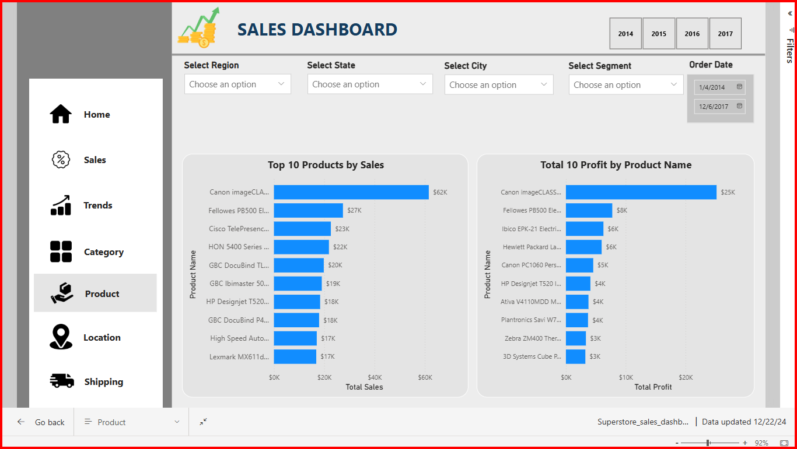

# SuperStore Sales Dashboard

👋 Hello Everyone!
I'm excited to present SuperStore Sales Dashboard, a comprehensive Power BI project from Power BI Data Analytics to upgrade my skills.

SuperStore Sales - Power BI Project

**Live Dashboard Link**: [Link](https://app.powerbi.com/groups/me/reports/d7d1ee26-87ad-418a-9d52-16bcff23ce51/af22ef29294bb3acb0a9?experience=power-bi)

**Linkedin Profile Link**: [Link](https://www.linkedin.com/in/vijay-v-534666209)

# Brief overview of the project:

**"SuperStore Sales"** - Powered by Power BI, this comprehensive dashboard provides sales with actionable insights across Sales trends, Sales performance, Product performance, Shipping analysis and Location analysis.

This project will showcases the potential of Power BI in transforming data into actionable insights, providing sales with the analytics they need for smarter business strategies

# <h3> Project Overview  </h3>
Superstore Sales is a data visualization and analysis project, create an interactive dashboard for exploring and analyzing sales data from a superstore. This project aims to provide an easy-to-use interface for users to gain insights into sales trends, Sales performance, product performance, Shipping analysis and Location analysis.

𝗧𝗼𝗼𝗹𝘀 𝗨𝘀𝗲𝗱 : SQL, Power BI Desktop, Excel, DAX language

𝗦𝗼𝗹𝘂𝘁𝗶𝗼𝗻 :
As an aspiring Data Analyst, I developed Power BI reports that deliver crucial insights into sales trends, Sales performance, product performance, Shipping analysis and Location analysis. These reports track essential KPIs, enabling informed, data-driven decisions across the company.

 **<h3>Home Page</h3>** 

  

 **<h3>Sales</h3>** 

  

 **<h3>Trends</h3>** 

  

 **<h3>Category</h3>** 

  

 **<h3>Product</h3>** 

  

 **<h3>Location</h3>** 

  

 **<h3>Shipping</h3>** 

  

# Features
1. Interactive Data Visualization: Visualize sales data through dynamic charts and graphs.
   
2. Filter and Search: Easily filter data by date, product category, region, and more.

3. Sales Trends: Analyze sales trends over time to make informed decisions.
   
4. Customer Insights: Gain insights into customer behavior and demographics.

5. Product Performance: Evaluate the performance of different product categories.

6. Export Data: Download selected data for further analysis.
